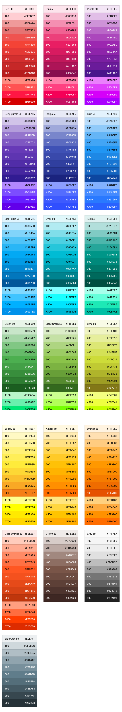

# MaterialColor

### Convenience class for Material colors

You can check out the color system [here](https://material.io/design/color/)

	

---

## Contributors

This project is maintained by the following people:

 |
--- |
[Tye Porter](https://github.com/4orter) |